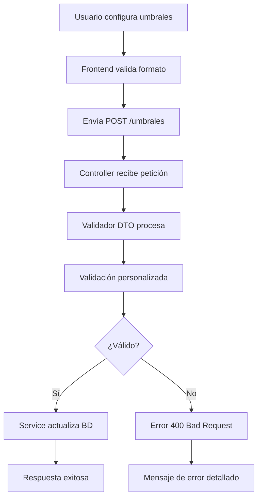
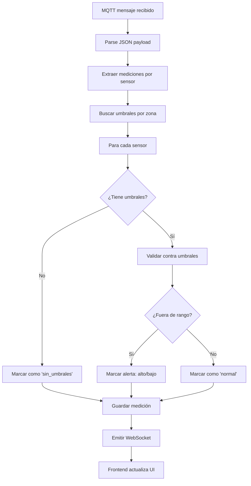

# Documentación Técnica - Sistema de Umbrales MQTT

## API Endpoints Documentados

### Endpoints de Gestión de Umbrales

#### 1. Obtener Umbrales
**Endpoint:** `GET /mqtt-config/zona-mqtt/:id/umbrales`

**Descripción:** Obtiene los umbrales configurados para una zona MQTT específica.

**Parámetros de Ruta:**
- `id` (string): ID de la configuración zona-mqtt

**Respuesta Exitosa (200):**
```json
{
  "id": "uuid-de-la-config",
  "fkZonaMqttConfigId": "uuid-de-la-config",
  "umbrales": {
    "temperatura": {
      "minimo": 15,
      "maximo": 35
    },
    "humedad": {
      "minimo": 40,
      "maximo": 80
    }
  },
  "estado": true,
  "createdAt": "2023-01-01T00:00:00.000Z",
  "updatedAt": "2023-01-01T00:00:00.000Z",
  "zonaNombre": "Zona Norte",
  "mqttConfigNombre": "Configuración Principal",
  "mqttConfigHost": "broker.example.com",
  "mqttConfigPort": 1883
}
```

**Códigos de Error:**
- `404 Not Found`: Si la configuración zona-mqtt no existe

**Implementación Backend:**
```typescript
// API_Nest_Agro_Tic/src/mqtt_config/mqtt_config.controller.ts
@Get('zona-mqtt/:id/umbrales')
async getUmbrales(@Param('id') id: string) {
  try {
    return await this.mqttConfigService.getUmbrales(id);
  } catch (error: any) {
    if (error instanceof NotFoundException) {
      throw new NotFoundException(error.message);
    }
    throw error;
  }
}
```

---

#### 2. Actualizar Umbrales
**Endpoint:** `PUT /mqtt-config/zona-mqtt/:id/umbrales`

**Descripción:** Actualiza los umbrales para una zona MQTT específica.

**Parámetros de Ruta:**
- `id` (string): ID de la configuración zona-mqtt

**Cuerpo de la Petición:**
```json
{
  "umbrales": {
    "temperatura": {
      "minimo": 18,
      "maximo": 32
    },
    "humedad": {
      "minimo": 45,
      "maximo": 75
    },
    "ph": {
      "minimo": 6.0,
      "maximo": 7.5
    }
  }
}
```

**Validaciones Implementadas:**
- Estructura JSON válida
- Cada umbral debe tener `minimo < maximo`
- Ambos valores deben ser números positivos
- No se aceptan valores NaN
- Keys de sensores deben ser strings válidos

**Respuesta Exitosa (200):**
```json
{
  "success": true,
  "message": "Umbrales actualizados exitosamente",
  "data": {
    "id": "uuid-de-la-config",
    "fkZonaMqttConfigId": "uuid-de-la-config",
    "umbrales": {
      "temperatura": { "minimo": 18, "maximo": 32 },
      "humedad": { "minimo": 45, "maximo": 75 },
      "ph": { "minimo": 6.0, "maximo": 7.5 }
    },
    "estado": true,
    "createdAt": "2023-01-01T00:00:00.000Z",
    "updatedAt": "2023-01-01T00:00:00.000Z"
  },
  "timestamp": "2023-01-01T12:00:00.000Z"
}
```

**Códigos de Error:**
- `400 Bad Request`: Si los umbrales no cumplen con las validaciones
- `404 Not Found`: Si la configuración zona-mqtt no existe

**Implementación Backend:**
```typescript
// API_Nest_Agro_Tic/src/mqtt_config/mqtt_config.controller.ts
@Put('zona-mqtt/:id/umbrales')
async updateUmbrales(
  @Param('id') id: string,
  @Body() updateUmbralesDto: UpdateUmbralesDto
) {
  try {
    return await this.mqttConfigService.updateUmbrales(id, updateUmbralesDto);
  } catch (error: any) {
    if (error instanceof NotFoundException) {
      throw new NotFoundException(error.message);
    }
    throw error;
  }
}
```

---

#### 3. Validar Umbrales
**Endpoint:** `POST /mqtt-config/zona-mqtt/:id/validate-threshold`

**Descripción:** Valida si un valor específico excede los umbrales establecidos para un tipo de sensor.

**Parámetros de Ruta:**
- `id` (string): ID de la configuración zona-mqtt

**Cuerpo de la Petición:**
```json
{
  "sensorType": "temperatura",
  "value": 25.5
}
```

**Validaciones:**
- `sensorType`: Debe ser un string
- `value`: Debe ser un número

**Respuesta Exitosa (200):**
```json
{
  "exceeds": false,
  "threshold": {
    "minimo": 18,
    "maximo": 32
  },
  "message": "El valor 25.5 está dentro del rango permitido [18, 32]"
}
```

**Casos de Respuesta:**

**Valor dentro del rango:**
```json
{
  "exceeds": false,
  "threshold": { "minimo": 18, "maximo": 32 },
  "message": "El valor 25.5 está dentro del rango permitido [18, 32]"
}
```

**Valor fuera del rango (alto):**
```json
{
  "exceeds": true,
  "threshold": { "minimo": 18, "maximo": 32 },
  "message": "El valor 35.2 está fuera del rango permitido [18, 32]",
  "status": "alto"
}
```

**Valor fuera del rango (bajo):**
```json
{
  "exceeds": true,
  "threshold": { "minimo": 18, "maximo": 32 },
  "message": "El valor 12.5 está fuera del rango permitido [18, 32]",
  "status": "bajo"
}
```

**Sin umbrales definidos:**
```json
{
  "exceeds": false,
  "message": "No hay umbrales definidos para el tipo de sensor: luminosidad"
}
```

**Códigos de Error:**
- `400 Bad Request`: Si los parámetros no son válidos
- `404 Not Found`: Si la configuración zona-mqtt no existe

---

## Estructura de Datos

### Schema de Base de Datos

```sql
-- Columna agregada a la tabla zona_mqtt_config
ALTER TABLE "zona_mqtt_config" ADD COLUMN "zmc_umbrales" jsonb NOT NULL DEFAULT '{}'::jsonb;

-- Índice para búsquedas eficientes
CREATE INDEX "idx_zona_mqtt_config_umbrales_gin" ON "zona_mqtt_config" USING GIN ("zmc_umbrales");

-- Comentario explicativo
COMMENT ON COLUMN "zona_mqtt_config"."zmc_umbrales" IS 
'Configuración de umbrales de sensores en formato JSON. 
Estructura esperada: {
  "temperatura": {"minimo": 15, "maximo": 30}, 
  "humedad": {"minimo": 40, "maximo": 80}, 
  "ph": {"minimo": 5.5, "maximo": 7.5}
}';
```

### Interfaces TypeScript

#### Frontend (`FrontEnd_AgroTic/src/services/zonasService.ts`)
```typescript
export interface SensorThreshold {
  minimo: number;
  maximo: number;
}

export interface UmbralesConfig {
  [sensorKey: string]: SensorThreshold;
}

export interface UmbralesResponse {
  success: boolean;
  message?: string;
  data?: any;
  timestamp?: string;
}
```

#### Backend DTOs (`API_Nest_Agro_Tic/src/mqtt_config/dto/update-umbrales.dto.ts`)
```typescript
export class UpdateUmbralesDto {
  @IsObject()
  @IsThresholdValid({ 
    message: 'Cada umbral debe tener minimo < maximo y ambos valores deben ser números positivos' 
  })
  umbrales: Record<string, { minimo: number; maximo: number }>;
}
```

### Validación de Estructura

**Reglas de Validación:**
1. **Estructura JSON**: Debe ser un objeto JSON válido
2. **Keys de Sensores**: Deben ser strings alfanuméricos
3. **Valores Numéricos**: `minimo` y `maximo` deben ser números
4. **Rangos Válidos**: `minimo < maximo`
5. **Valores Positivos**: Ambos valores ≥ 0
6. **No NaN**: Los valores no pueden ser `NaN`

**Ejemplos de Estructuras Válidas:**
```json
{
  "temperatura": { "minimo": 15, "maximo": 30 },
  "humedad": { "minimo": 40, "maximo": 80 }
}
```

```json
{
  "ph": { "minimo": 6.0, "maximo": 7.5 },
  "conductividad": { "minimo": 1000, "maximo": 3000 }
}
```

---

## Flujo de Datos Completo

### 1. Arquitectura de Componentes

```
┌─────────────────────────────────────────────────────────────┐
│                     FRONTEND (React)                        │
├─────────────────────────────────────────────────────────────┤
│  ThresholdConfigModal.tsx                                   │
│  ├── Formulario de configuración                            │
│  ├── Validación en tiempo real                              │
│  └── Envío via API REST                                    │
└─────────────────────────────────────────────────────────────┘
                              │ HTTP PUT/GET
                              ▼
┌─────────────────────────────────────────────────────────────┐
│                   BACKEND (NestJS)                          │
├─────────────────────────────────────────────────────────────┤
│  MqttConfigController                                       │
│  ├── GET /zona-mqtt/:id/umbrales                           │
│  ├── PUT /zona-mqtt/:id/umbrales                           │
│  └── POST /zona-mqtt/:id/validate-threshold                │
│                                                              │
│  MqttConfigService                                          │
│  ├── getUmbrales()                                          │
│  ├── updateUmbrales()                                       │
│  └── validateThreshold()                                    │
└─────────────────────────────────────────────────────────────┘
                              │ TypeORM
                              ▼
┌─────────────────────────────────────────────────────────────┐
│                BASE DE DATOS (PostgreSQL)                   │
├─────────────────────────────────────────────────────────────┤
│  tabla: zona_mqtt_config                                    │
│  ├── id: uuid                                              │
│  ├── zmc_umbrales: jsonb                                   │
│  └── estado: boolean                                       │
│                                                              │
│  índices:                                                   │
│  └── GIN index en zmc_umbrales                             │
└─────────────────────────────────────────────────────────────┘
```

### 2. Flujo de Validación de Umbrales



### 3. Flujo de Validación en Tiempo Real



---

## Ejemplos de Código

### Cliente Frontend (Axios)

#### Obtener Umbrales
```typescript
async getUmbrales(zonaMqttConfigId: string): Promise<UmbralesConfig> {
  try {
    const response = await axios.get(
      `/mqtt-config/zona-mqtt/${zonaMqttConfigId}/umbrales`
    );
    
    if (response.data && response.data.umbrales) {
      return response.data.umbrales;
    }
    
    return {};
  } catch (error: any) {
    console.error('Error al obtener umbrales:', error);
    throw new Error(`Error al obtener umbrales: ${error.response?.data?.message || error.message}`);
  }
}
```

#### Actualizar Umbrales
```typescript
async updateUmbrales(zonaMqttConfigId: string, umbrales: UmbralesConfig): Promise<void> {
  try {
    // Validación local antes de enviar
    this.validateUmbralesData(umbrales);
    
    const response = await axios.put(
      `/mqtt-config/zona-mqtt/${zonaMqttConfigId}/umbrales`,
      { umbrales }
    );

    if (!response.data.success) {
      throw new Error(response.data.message || 'Error al actualizar umbrales');
    }
  } catch (error: any) {
    console.error('Error al actualizar umbrales:', error);
    throw new Error(`Error al actualizar umbrales: ${error.response?.data?.message || error.message}`);
  }
}
```

#### Validación Local
```typescript
private validateUmbralesData(umbrales: UmbralesConfig): void {
  if (typeof umbrales !== 'object' || umbrales === null) {
    throw new Error('Los umbrales deben ser un objeto válido');
  }

  for (const [sensorKey, threshold] of Object.entries(umbrales)) {
    if (typeof threshold !== 'object' || threshold === null) {
      throw new Error(`El umbral para ${sensorKey} debe ser un objeto`);
    }

    const { minimo, maximo } = threshold;
    
    if (typeof minimo !== 'number' || typeof maximo !== 'number') {
      throw new Error(`Los valores mínimo y máximo para ${sensorKey} deben ser números`);
    }

    if (minimo >= maximo) {
      throw new Error(`El valor mínimo debe ser menor que el máximo para ${sensorKey}`);
    }

    if (isNaN(minimo) || isNaN(maximo)) {
      throw new Error(`Los valores para ${sensorKey} no pueden ser NaN`);
    }
  }
}
```

### Backend Service (NestJS)

#### MqttConfigService
```typescript
async getUmbrales(zonaMqttConfigId: string) {
  const zonaMqttConfig = await this.zonaMqttConfigRepository.findOne({
    where: { id: zonaMqttConfigId },
    relations: ['mqttConfig', 'zona']
  });

  if (!zonaMqttConfig) {
    throw new NotFoundException(`Configuración zona-mqtt ${zonaMqttConfigId} no encontrada`);
  }

  return {
    id: zonaMqttConfig.id,
    fkZonaMqttConfigId: zonaMqttConfig.id,
    umbrales: zonaMqttConfig.zmc_umbrales || {},
    estado: zonaMqttConfig.estado,
    createdAt: zonaMqttConfig.createdAt,
    updatedAt: zonaMqttConfig.updatedAt,
    zonaNombre: zonaMqttConfig.zona?.nombre,
    mqttConfigNombre: zonaMqttConfig.mqttConfig?.nombre,
    mqttConfigHost: zonaMqttConfig.mqttConfig?.host,
    mqttConfigPort: zonaMqttConfig.mqttConfig?.port
  };
}

async updateUmbrales(zonaMqttConfigId: string, updateUmbralesDto: UpdateUmbralesDto) {
  const zonaMqttConfig = await this.zonaMqttConfigRepository.findOne({
    where: { id: zonaMqttConfigId }
  });

  if (!zonaMqttConfig) {
    throw new NotFoundException(`Configuración zona-mqtt ${zonaMqttConfigId} no encontrada`);
  }

  // Actualizar umbrales
  zonaMqttConfig.zmc_umbrales = updateUmbralesDto.umbrales;
  await this.zonaMqttConfigRepository.save(zonaMqttConfig);

  return {
    success: true,
    message: 'Umbrales actualizados exitosamente',
    data: {
      id: zonaMqttConfig.id,
      fkZonaMqttConfigId: zonaMqttConfig.id,
      umbrales: zonaMqttConfig.zmc_umbrales,
      estado: zonaMqttConfig.estado,
      createdAt: zonaMqttConfig.createdAt,
      updatedAt: zonaMqttConfig.updatedAt
    },
    timestamp: new Date()
  };
}

async validateThreshold(zonaMqttConfigId: string, sensorType: string, value: number) {
  const zonaMqttConfig = await this.zonaMqttConfigRepository.findOne({
    where: { id: zonaMqttConfigId }
  });

  if (!zonaMqttConfig) {
    throw new NotFoundException(`Configuración zona-mqtt ${zonaMqttConfigId} no encontrada`);
  }

  const umbrales = zonaMqttConfig.zmc_umbrales || {};
  const threshold = umbrales[sensorType];

  if (!threshold) {
    return {
      exceeds: false,
      message: `No hay umbrales definidos para el tipo de sensor: ${sensorType}`
    };
  }

  const exceeds = value < threshold.minimo || value > threshold.maximo;
  let status = 'normal';
  let message = '';

  if (value < threshold.minimo) {
    status = 'bajo';
    message = `El valor ${value} está por debajo del rango permitido [${threshold.minimo}, ${threshold.maximo}]`;
  } else if (value > threshold.maximo) {
    status = 'alto';
    message = `El valor ${value} está por encima del rango permitido [${threshold.minimo}, ${threshold.maximo}]`;
  } else {
    message = `El valor ${value} está dentro del rango permitido [${threshold.minimo}, ${threshold.maximo}]`;
  }

  return {
    exceeds,
    threshold,
    status,
    message
  };
}
```

### Validación Personalizada DTO

```typescript
// API_Nest_Agro_Tic/src/mqtt_config/dto/update-umbrales.dto.ts
export function IsThresholdValid(validationOptions?: any) {
  return function (object: Object, propertyName: string) {
    registerDecorator({
      name: 'isThresholdValid',
      target: object.constructor,
      propertyName: propertyName,
      constraints: [],
      options: validationOptions,
      validator: {
        validate(value: any, args: ValidationArguments) {
          if (!value || typeof value !== 'object') {
            return false;
          }

          for (const [sensorKey, threshold] of Object.entries(value)) {
            if (!threshold || typeof threshold !== 'object') {
              return false;
            }

            // Verificar que minimo y maximo existen y son números
            if (typeof threshold.minimo !== 'number' || typeof threshold.maximo !== 'number') {
              return false;
            }

            // Verificar que no son NaN
            if (isNaN(threshold.minimo) || isNaN(threshold.maximo)) {
              return false;
            }

            // Verificar que minimo < maximo
            if (threshold.minimo >= threshold.maximo) {
              return false;
            }

            // Verificar que ambos valores son positivos
            if (threshold.minimo < 0 || threshold.maximo < 0) {
              return false;
            }
          }

          return true;
        },
        defaultMessage(args: ValidationArguments) {
          return 'Cada umbral debe tener minimo < maximo y ambos valores deben ser números positivos';
        }
      },
    });
  };
}
```

---

## Integración con MQTT

### Validación en Tiempo Real

El servicio MQTT integra la validación de umbrales durante el procesamiento de mensajes:

```typescript
// API_Nest_Agro_Tic/src/mqtt/mqtt.service.ts
private async processSensorData(zonaMqttConfigId: string, zonaId: string, payload: any, zonaMqttConfig?: any) {
  // Verificar que la zona MQTT config esté activa
  const isActive = await this.mqttConfigService.isZonaMqttConfigActive(zonaMqttConfigId);
  if (!isActive) {
    this.logger.warn(`Datos MQTT recibidos para zona inactiva ${zonaId}, ignorando`);
    return;
  }

  // Obtener umbrales para validación
  const umbrales = zonaMqttConfig?.zmc_umbrales || {};
  
  const realTimeMediciones: any[] = [];

  Object.entries(payload).forEach(([key, value]) => {
    if (typeof value === 'string' || typeof value === 'number') {
      const parsed = this.parseValueWithUnit(String(value));
      const numericValue = parsed.n;

      // Validar contra umbrales si existen
      let thresholdStatus: 'normal' | 'bajo' | 'alto' = 'normal';
      let hasThresholds = Object.keys(umbrales).length > 0;

      if (umbrales[key]) {
        const threshold = umbrales[key];
        if (numericValue < threshold.minimo) {
          thresholdStatus = 'bajo';
        } else if (numericValue > threshold.maximo) {
          thresholdStatus = 'alto';
        } else {
          thresholdStatus = 'normal';
        }
      }

      const medicion = {
        key,
        valor: numericValue,
        unidad: parsed.unit,
        fechaMedicion: new Date(),
        fkZonaMqttConfigId: zonaMqttConfigId,
        thresholdStatus,
        hasThresholds
      };

      realTimeMediciones.push(medicion);
      this.addToBuffer(zonaMqttConfigId, medicion);
    }
  });

  if (realTimeMediciones.length > 0) {
    // Emitir lecturas en tiempo real con estado de umbrales
    this.mqttGateway.emitNuevaLectura({
      zonaId,
      mediciones: realTimeMediciones,
      timestamp: new Date(),
    });

    await this.checkAndSaveBufferedReadings(zonaMqttConfigId);
  }
}
```

### WebSocket Gateway

```typescript
// API_Nest_Agro_Tic/src/mqtt/mqtt.gateway.ts
@WebSocketGateway()
export class MqttGateway {
  @WebSocketServer()
  server: Server;

  emitNuevaLectura(data: any) {
    this.server.emit('nuevaLectura', data);
  }

  emitEstadoConexion(data: any) {
    this.server.emit('estadoConexion', data);
  }
}
```

---

## Optimizaciones y Rendimiento

### Índices de Base de Datos

1. **Índice GIN en JSONB**: Permite búsquedas eficientes por keys de sensores
2. **Índice compuesto**: `(estado, zmc_umbrales)` para consultas de configuraciones activas

### Consultas Optimizadas

```sql
-- Buscar configuraciones con umbrales específicos
SELECT id, zona_id, zmc_umbrales->>'temperatura' as temp_min
FROM zona_mqtt_config 
WHERE estado = true 
AND zmc_umbrales ? 'temperatura';

-- Contar sensores por zona con umbrales
SELECT z.nombre, 
       COUNT(DISTINCT jsonb_object_keys(zmc.zmc_umbrales)) as sensores_con_umbrales
FROM zona_mqtt_config zmc
JOIN zona z ON z.id = zmc.zone_id
WHERE zmc.estado = true 
AND jsonb_typeof(zmc.zmc_umbrales) = 'object'
GROUP BY z.nombre;
```

### Caching Strategy

```typescript
// Cache de umbrales en memoria para validación rápida
private umbralesCache = new Map<string, { data: any, timestamp: number }>();
private readonly CACHE_TTL = 5 * 60 * 1000; // 5 minutos

async getUmbralesWithCache(zonaMqttConfigId: string) {
  const cached = this.umbralesCache.get(zonaMqttConfigId);
  
  if (cached && (Date.now() - cached.timestamp) < this.CACHE_TTL) {
    return cached.data;
  }

  const umbrales = await this.getUmbrales(zonaMqttConfigId);
  this.umbralesCache.set(zonaMqttConfigId, { data: umbrales, timestamp: Date.now() });
  
  return umbrales;
}
```

---

## Testing

### Tests Unitarios

```typescript
// tests/umbrales.service.spec.ts
describe('UmbralesService', () => {
  it('should validate umbrales correctly', async () => {
    const validUmbrales = {
      temperatura: { minimo: 18, maximo: 30 },
      humedad: { minimo: 40, maximo: 80 }
    };

    const result = await service.updateUmbrales('test-id', { umbrales: validUmbrales });
    expect(result.success).toBe(true);
  });

  it('should reject invalid umbrales', async () => {
    const invalidUmbrales = {
      temperatura: { minimo: 30, maximo: 20 } // minimo > maximo
    };

    await expect(
      service.updateUmbrales('test-id', { umbrales: invalidUmbrales })
    ).rejects.toThrow();
  });
});
```

### Tests de Integración

```typescript
// tests/umbrales.e2e-spec.ts
describe('Umbrales E2E', () => {
  it('/PUT /mqtt-config/zona-mqtt/:id/umbrales (update)', () => {
    const updateDto = {
      umbrales: {
        ph: { minimo: 6.0, maximo: 7.5 }
      }
    };

    return request(app.getHttpServer())
      .put('/mqtt-config/zona-mqtt/test-id/umbrales')
      .send(updateDto)
      .expect(200)
      .expect((res) => {
        expect(res.body.success).toBe(true);
        expect(res.body.data.umbrales.ph.minimo).toBe(6.0);
      });
  });
});
```

---

**Última actualización**: 20 de Noviembre, 2025
**Versión**: 1.0.0